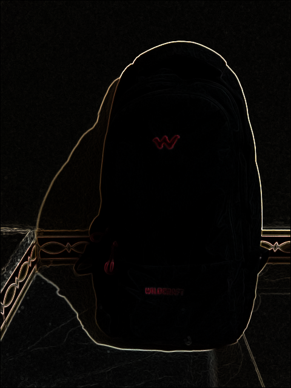
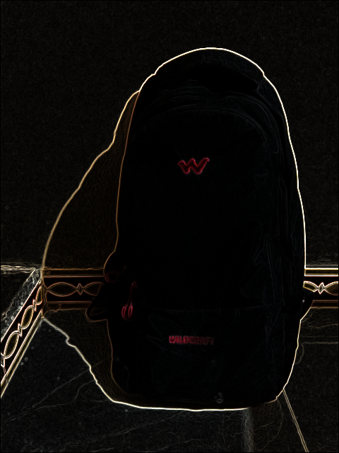
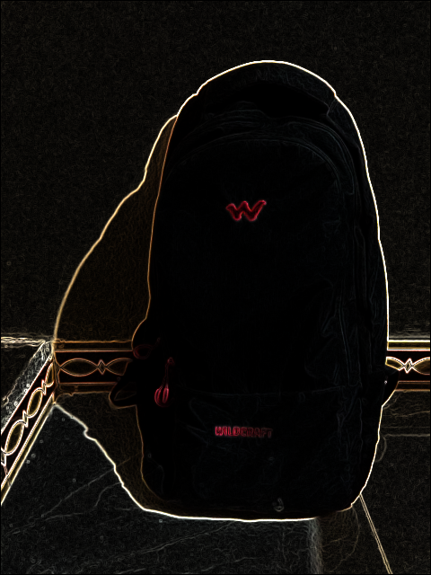

# Edge detection WITHOUT OpenCV
  
Reinventing the wheel but, you know, why not...
  
  
  
Input image:-  

  
  
Outputs:-  
  
  
Highlighting intensity: 1  
  
  
Highlighting intensity: 2  
  
  
Highlighting intensity: 4  
  
  
Highlighting intensity: 6  
  
  
Highlighting intensity: 8  
  
  
  
### Use  
`./edge <path/input_image.extension> <path/output_image.extension> <highlighting intensity[normal:1]>`  
  
Example:-  
`./edge catto.png catto_weird.png 6`  
